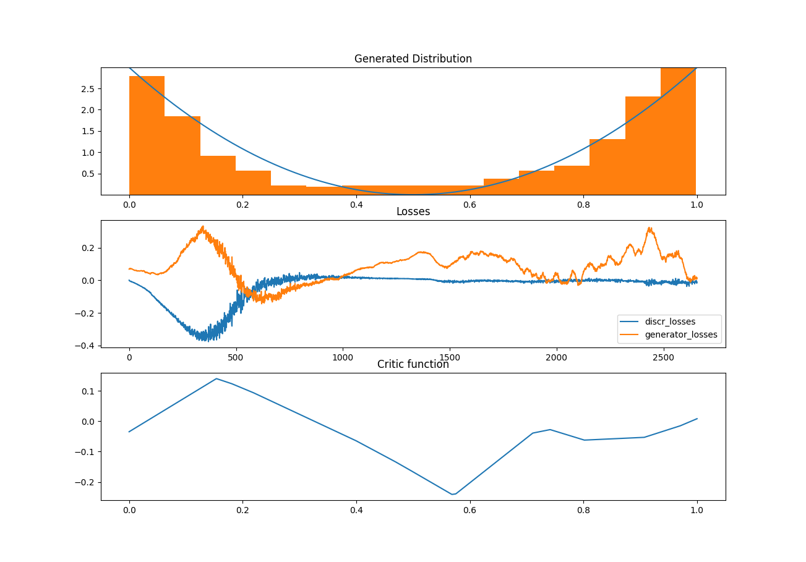

# 1D Toy Training Test/Example of GAN/WGAN
In this project we visualize the training process of a GAN or Wasserstein GAN for a simple 1D distribution.
You can change the script **main.py** in order to:
* Switch between **JensonShannonGAN** (Vanilla Gan) and **WassersteinGAN**
* Change the number of training iterations **ncritic** for the discriminator/critic per iteration of generative training.
* Adjust **learning rate** and the **gradient penalty** for WassersteinGAN and inspect the effect on the gradient based optimization.
* Change the target distribution on $[0,1]$ by adjusting the **y** variable in the script 
## Results

    

