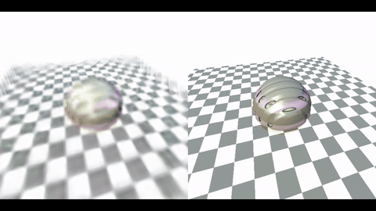
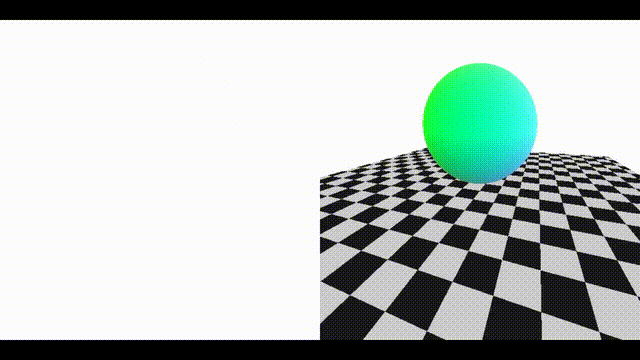

## Reconstruction of a Scene with Specular Highlights
<center>
<figure>

<figcaption>
Credits: The shader on the right is based on  

[this shader](https://www.shadertoy.com/view/lstXRl)
</figcaption>
</figure>
</center>


## Reconstruction of a Diffuse Scene
<center>

</center>

### Basic Approach (Differentiable Volumetric Renderer)
The scene is represented by a radiance field $R(x, d)$ and density $\sigma(x)$. Here $x \in \mathbb{R}^3$ is the position in the volume and $d \in \mathbb{S}^2$ is the viewing direction. The accumulated radiance along a ray $\{x + td\ \mid t \in [t_0, t_1]\}$ is given by

$$
I(x,\  d) = \int_{t_0}^{t_1} T(x,\ d,\ t)\  R(x + td,\  d) \ dt,
$$

with

$$
T(x,\ d,\ t) = \exp(-\int_{t_0}^t \sigma(x + sd)\  ds)
$$

Here $T$ is called transmittance and the integrals are approximated by quadrature rules in practice.\
Given a differentiable parameterization $R(x, d, \theta)$, $\sigma(x, d, \theta)$ the goal is to minimize the difference between $I(x_j, d_j, \theta)$ and $\hat{I_j}$ for groundtruth measurements $\hat{I_j}$ from real images  corresponding to rays $(x_j, d_j)_{j=1...N}$ in order to recover $\theta$.
### Parameterization (Voxel Grid with Trilinear Interpolation)
Trilinear interpolation on a grid $F_{i, j, k}$ with spacing $h > 0$ is given by

$$
f(x) = \sum_{l=0}^1\sum_{m=0}^1\sum_{n=0}^1 u^{l}(1-u)^{1-l} v^{l}(1-m)^{1-m} w^{n}(1-w)^{1-n} F_{i+l, j+m, k+n}
$$

where 

$$x = h ( \begin{bmatrix} i \\ j \\ k\end{bmatrix} + \begin{bmatrix} u \\ v \\ w\end{bmatrix})$$ 

for $u,\ v,\ w \in (0,1)$ and 

$$\begin{bmatrix} i \\ j \\ k \end{bmatrix} = \text{floor}(h^{-1}x).$$

To reduce artifacts the grid functions are penalized with a [total variation](https://en.wikipedia.org/wiki/Total_variation) regularization of the form 

$$\int |\nabla f| \ dx.$$

The gradient $\nabla f$ is approximated by finite differences from $F_{ijk}$.

The density $\sigma$ and radiance $R$ are both parametrizied using the above formulas. However in the specular/plenoptic case where $R$ depends on the viewing direction trilinear interpolation is instead used to interpolate [spherical harmonics coefficients](https://en.wikipedia.org/wiki/Spherical_harmonics) instead of directly interpolating the radiance.

## Training and Visualization
First cd into the directory for the diffuse or specular model. Training the diffuse model requires fewer training iterations, and less GPU memory.
```bash
$ cd specular
```
or
```bash
$ cd diffuse
```
Then start by generating the training data for the model
```bash
$ python generate_data.py
```

Now you can train the model
```bash
$ python train.py
```

In order to inspect the training progress you can run
```
$ ptyhon visualizer.py
```

If you are training the model while running the visualizer you may encounter problems since rendering the scene takes up GPU resources. If you have [mesa](https://mesa3d.org/) installed on a UNIX system you can force software rendering to combat this
```bash
$ LIBGL_ALWAYS_SOFTWARE=1 python visualizer.py
``` 

## References
* [1] **Plenoxels: Radiance Fields Without Neural Networks.** Fridovich-Keil, S., Yu, A., Tancik, M., Chen, Q., Recht, B., Kanazawa, A.Alex Yu, Sara Fridovich-Keil, Matthew Tancik, Qinhong Chen, Benjamin Recht, Angjoo Kanazawa (2022). [arXiv-Paper](https://arxiv.org)
