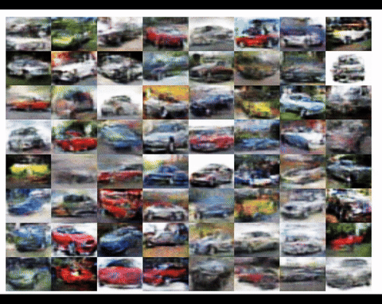

# Wasserstein GAN on CIFAR10 Automobile Class

## Basic Theory
We are given training data $\\{x_i \mid i=1,...,N \\} \subset \mathbb{R}^d$ write $\mu_{data} = \frac{1}{N} \sum_{j=1}^N \delta_{x_i}$. The WGAN algorithm now uses two classes of functions (each parameterized by a neural network): 

$$ 
g_\theta(x) : \mathbb{R}^{l} \rightarrow \mathbb{R}^d \text{ and } d_{\phi}(x) : \mathbb{R}^d \rightarrow \mathbb{R}.
$$

The map is $d_\phi$ is called discriminator or critic and $g_\theta$ is called generator. It induces a pushforward measure $\mu_G = g_{\theta} \\# \mathcal{N}(0, I^l)$ on $\mathbb{R}^d$. The goal is to minimize the Wasserstein (earth-movers) distance with respect to $\theta$ using gradient based techniques

$$
W_1(\mu_G,\ \mu_{data}) = \inf_{\gamma\ \in\  \Gamma(\mu_G, \mu_{data})} \mathbb{E}_{X,\ Y \sim \gamma}[|X-Y|_2].
$$

Here $\Gamma(\mu_G, \mu_{data})$ is the set of probability measures on $\mathbb{R}^d \times \mathbb{R}^d$ with marginals $\mu_G,\ \mu_{data}$.
Importantly the Kantorwich-Rubenstein duality implies that this can be rewritten as.   

$$
W_{1}(\mu_G ,\mu_{data} )= \sup _{\|d\|_{L} = 1}\mathbb {E} _{X\sim \mu_G }[d(X)]-\mathbb {E} _{Y\sim \mu_{data} }[d(Y)]
$$ 

Here $\lVert . \rVert_L$ is the Lipschitz norm and in practice the supremum is replaced by 

$$
\sup_{\phi} \ \mathbb {E}_{X\sim \mu_G }[d_{\phi}(X)]-\mathbb {E} _{Y\sim \mu_{data} }[d_{\phi}(Y)].
$$

In order to enforce the constraint $\lVert d_{\phi} \rVert_L = 1$ a gradient penalty term (computed using autograd in practice) is added to the loss function for the critic $d_\phi$

$$
{\displaystyle \mathbb {E} _{X \sim {\nu }}[(|\nabla d_\phi(X)|_{2}-1)^{2}]}.
$$

This approach for enforcing the Lipschitz bound including the choice for the distribution $\nu$ was outlined in [2], where the authors proposed to sample $\nu$ by interpolation between samples from $\mu_{data}$ and samples from $\mu_g$. 

## Results

    

## References
* [1] **Wasserstein GAN** Martin Arjovsky, Soumith Chintala, and Leon Bottou (2022). [arXiv-Paper](https://arxiv.org/pdf/1701.07875)
* [2] **Improved Training of Wasserstein GANs**  Ishaan Gulrajani, Faruk Ahmed, Martin Arjovsky, Vincent Dumoulin, Aaron C. Courville [NeurIPS-Paper](https://proceedings.neurips.cc/paper/2017/hash/892c3b1c6dccd52936e27cbd0ff683d6-Abstract.html)
